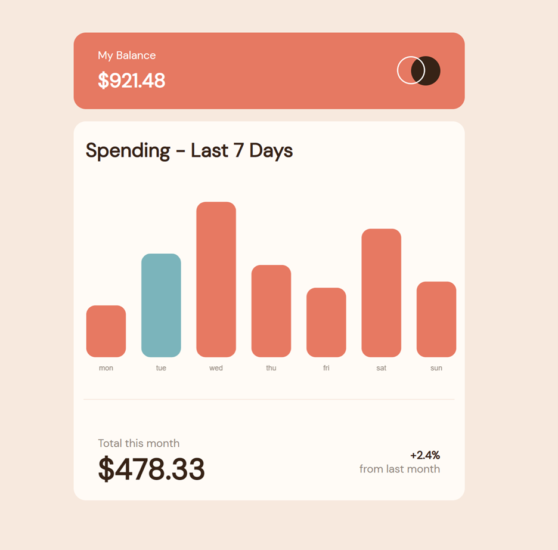

# Frontend Mentor - Expenses chart component solution

This is a solution to the [Expenses chart component challenge on Frontend Mentor](https://www.frontendmentor.io/challenges/expenses-chart-component-e7yJBUdjwt). Frontend Mentor challenges help you improve your coding skills by building realistic projects. 

## Table of contents

- [Overview](#overview)
  - [The challenge](#the-challenge)
  - [Screenshot](#screenshot)
  - [Links](#links)
- [My process](#my-process)
  - [Built with](#built-with)
  - [What I learned](#what-i-learned)
  - [Continued development](#continued-development)
  - [Useful resources](#useful-resources)
- [Author](#author)
- [Acknowledgments](#acknowledgments)

**Note: Delete this note and update the table of contents based on what sections you keep.**

## Overview

### The challenge

Users should be able to:

- View the bar chart and hover over the individual bars to see the correct amounts for each day
- See the current day’s bar highlighted in a different colour to the other bars
- View the optimal layout for the content depending on their device’s screen size
- See hover states for all interactive elements on the page
- **Bonus**: Use the JSON data file provided to dynamically size the bars on the chart

### Screenshot




### Links

- Solution URL: [Click here](https://urealaden.github.io/chart-component/)
- Live Site URL: [Click here](https://urealaden.github.io/chart-component/)

## My process

### Built with

- Semantic HTML5 markup
- CSS custom properties
- Flexbox
- CSS Grid
- Mobile-first workflow
- [React](https://reactjs.org/) - JS library
- [Styled Components](https://styled-components.com/) - For styles
- Merged Styles

**Note: These are just examples. Delete this note and replace the list above with your own choices**

### What I learned

Use this section to recap over some of your major learnings while working through this project. Writing these out and providing code samples of areas you want to highlight is a great way to reinforce your own knowledge.

To see how you can add code snippets, see below:

```js
 const labels = jsonData.map((entry) => entry.day);
    const today = new Date().toString().split(" ")[0].toLowerCase();
    const dataset = [{
        label: "Total Spent",
        data: jsonData.map((entry) => entry.amount),
        backgroundColor: jsonData.map((entry) => entry.day === today ? cyan : redOrange),
        borderRadius: 15,
        borderSkipped: false,
    }];
    const data = { labels, datasets: dataset };
    const option = {
        plugins: {
            legend: {
                display: false
            },
        },
        scales: {
            x: {
                grid: {
                    display: false
                },
                border: {
                    display: false
                },
                ticks: {
                    color: lightBrown
                }
            },
            y: {
                grid: {
                    display: false
                },
                ticks: {
                    display: false,
                },
                border: {
                    display: false,
                }
            }
        }
    }
    return (
        <Bar data={data} options={option} />
    )
```

If you want more help with writing markdown, we'd recommend checking out [The Markdown Guide](https://www.markdownguide.org/) to learn more.

**Note: Delete this note and the content within this section and replace with your own learnings.**

### Continued development

Use this section to outline areas that you want to continue focusing on in future projects. These could be concepts you're still not completely comfortable with or techniques you found useful that you want to refine and perfect.

**Note: Delete this note and the content within this section and replace with your own plans for continued development.**

### Useful resources

- [Example resource 1](https://www.example.com) - This helped me for XYZ reason. I really liked this pattern and will use it going forward.
- [Example resource 2](https://www.example.com) - This is an amazing article which helped me finally understand XYZ. I'd recommend it to anyone still learning this concept.

**Note: Delete this note and replace the list above with resources that helped you during the challenge. These could come in handy for anyone viewing your solution or for yourself when you look back on this project in the future.**

## Author

- Website - [Leaundrae Mckinney](https://www.linkedin.com/in/leaundrae-mckinney/)
- Frontend Mentor - [@UreaLaden](https://www.frontendmentor.io/profile/UreaLaden)